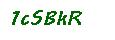

# ZRA Captcha Solver

Solves the login captchas on ZRA's website.

## History

After ZRA updated their portal and captcha's, [OCRAD.js](https://www.npmjs.com/package/ocrad.js) was no longer accurate. Various configurations were tried to try and get better results but OCRAD struggled to deal with the connected characters in the captchas. It was only able to achieve about 59% character accuracy and 7% full string accuracy.

[Tesseract.js](https://www.npmjs.com/package/tesseract.js) was also tried and while it faired much better, it was still only able to achieve about 71% character accuracy and 26% full string accuracy.
