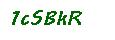

# ZRA Captcha Solver

Solves the login captchas on ZRA's website.



## Installation

Download and install [Docker](https://docs.docker.com/get-started/).

Pull the Tensorflow docker image:

```bash
# CPU only
docker pull tensorflow/tensorflow:1.15.2-py3

# Nvidia GPU
docker pull tensorflow/tensorflow:1.15.2-gpu-py3
docker pull nvidia/cuda:10.0-base
# See https://www.tensorflow.org/install/docker#gpu_support
```

Build the custom docker image and then run it with:

```bash
docker build --rm -f "dockerfile" -t zra-captcha:latest "."
```

Then give Docker access to this project's source code on your machine.

```bash
# CPU only
docker run -it --rm -u (id -u):(id -g) -v $PWD:/tmp -w /tmp "zra-captcha:latest" bash

# Nvidia GPU
docker run --gpus all -it --rm -u (id -u):(id -g) -v $PWD:/tmp -w /tmp "zra-captcha:latest" bash
```

## Usage

### Dataset generation

Create TensorFlow datasets from images and annotations.

```bash
aocr dataset ./datasets/annotations-training.txt ./datasets/training.tfrecords --no-force-uppercase
aocr dataset ./datasets/annotations-testing.txt ./datasets/testing.tfrecords --no-force-uppercase
```

### Training

```bash
aocr train ./datasets/training.tfrecords --max-width=115 --max-height=40 --full-ascii
```

Training for about 1000 steps seems to yield a sufficiently accurate model.

### Model validation

```bash
aocr test ./datasets/testing.tfrecords --max-width=115 --max-height=40 --full-ascii
```

### Export final model

```bash
aocr export ./exported-model/1 --max-width=115 --max-height=40 --full-ascii
```

You can now exit the bash prompt using the `exit` command.

## Serving trained model

Assuming you have already installed [Docker](https://docs.docker.com/get-started/), run the following command:

```bash
docker run -d -p 8501:8501 --mount type=bind,source=$PWD/exported-model,target=/models/captcha -e MODEL_NAME=captcha -t tensorflow/serving
```

The command expects the command to be in the current working directory and to be called `exported-model`.

## History

After ZRA updated their portal and captcha's, [OCRAD.js](https://www.npmjs.com/package/ocrad.js) was no longer accurate. Various configurations were tried to try and get better results but OCRAD struggled to deal with the connected characters in the captchas. It was only able to achieve about 59% character accuracy and 7% full string accuracy.

[Tesseract.js](https://www.npmjs.com/package/tesseract.js) was also tried and while it faired much better, it was still only able to achieve about 71% character accuracy and 26% full string accuracy.

It was clear at this point that a more advanced model was required using machine learning. [This excellent blog post](https://labs.f-secure.com/blog/captcha22/) about solving captchas provided a solution using [Tensorflow](tensorflow.org/) and [Attention OCR](https://github.com/emedvedev/attention-ocr/). This project is basically just a fork of their GitHub repo: <https://github.com/FSecureLABS/captcha_cracking>.
